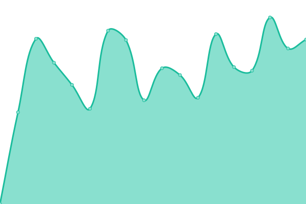
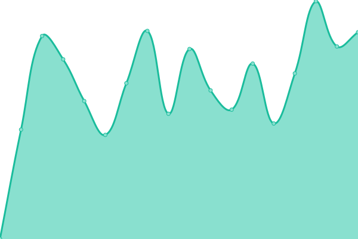
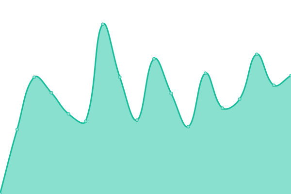

# [📈 Live Status](https://hjstrauss.github.io/MonitorMySites): <!--live status--> **🟥 Complete outage**

This repository contains the open-source uptime monitor and status page for [hjstrauss](https://hjstrauss.github.io/MonitorMySites), powered by [Upptime](https://github.com/upptime/upptime).

With [Upptime](https://upptime.js.org), you can get your own unlimited and free uptime monitor and status page, powered entirely by a GitHub repository. We use [Issues](https://github.com/hjstrauss/MonitorMySites/issues) as incident reports, [Actions](https://github.com/hjstrauss/MonitorMySites/actions) as uptime monitors, and [Pages](https://hjstrauss.github.io/MonitorMySites) for the status page.

<!--start: status pages-->
<!-- This summary is generated by Upptime (https://github.com/upptime/upptime) -->
<!-- Do not edit this manually, your changes will be overwritten -->
<!-- prettier-ignore -->
| URL | Status | History | Response Time | Uptime |
| --- | ------ | ------- | ------------- | ------ |
|  [HJStrauss](https://www.hjstrauss.de) | 🟥 Down | [hj-strauss.yml](https://github.com/hjstrauss/MonitorMySites/commits/HEAD/history/hj-strauss.yml) | 

 722ms
     
 | 

<a href="https://hjstrauss.github.io/MonitorMySites/history/hj-strauss">91.11%</a>
    

|  [Reime ohne Sinn und Verstand](https://www.reimeohnesinnundverstand.de) | 🟥 Down | [reime-ohne-sinn-und-verstand.yml](https://github.com/hjstrauss/MonitorMySites/commits/HEAD/history/reime-ohne-sinn-und-verstand.yml) | 

 1399ms
     
 | 

<a href="https://hjstrauss.github.io/MonitorMySites/history/reime-ohne-sinn-und-verstand">91.59%</a>
    

|  [Griffo](https://www.griffo.de) | 🟥 Down | [griffo.yml](https://github.com/hjstrauss/MonitorMySites/commits/HEAD/history/griffo.yml) | 

 1208ms
     
 | 

<a href="https://hjstrauss.github.io/MonitorMySites/history/griffo">91.77%</a>
    

|  [LM Bogen WSV](https://www.lmbogenwsv.de) | 🟥 Down | [lm-bogen-wsv.yml](https://github.com/hjstrauss/MonitorMySites/commits/HEAD/history/lm-bogen-wsv.yml) | 

 1197ms
     
 | 

<a href="https://hjstrauss.github.io/MonitorMySites/history/lm-bogen-wsv">92.25%</a>
    

<!--end: status pages-->

[**Visit our status website →**](https://hjstrauss.github.io/MonitorMySites)

## 📄 License

- Powered by: [Upptime](https://github.com/upptime/upptime)
- Code: [MIT](./LICENSE) © [Anand Chowdhary](https://anandchowdhary.com), supported by [Pabio](https://pabio.com)
- Data in the `./history` directory: [Open Database License](https://opendatacommons.org/licenses/odbl/1-0/)
